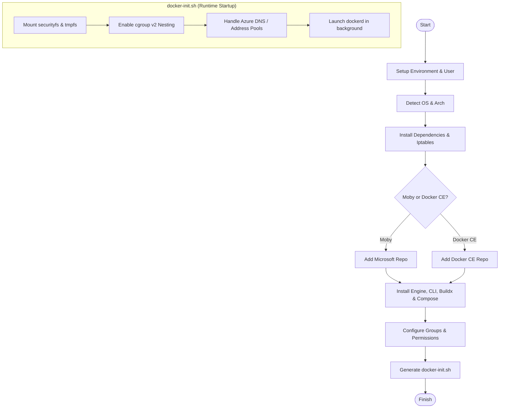

## Project Structure

```text
.
├── .github/workflows
│   ├── release.yaml              # Releases features to GHCR and create PR for feature's README.md
│   ├── test.yaml                 # CI for running feature tests
│   └── validate.yaml             # Validates feature metadata
├── src/docker-in-docker
│   ├── devcontainer-feature.json # Feature metadata & options
│   ├── install.sh                # Main installation script
│   ├── NOTES.md                  # Internal notes & implementation details
│   └── README.md                 # Feature documentation
└── test/docker-in-docker
    ├── scenarios.json            # Test matrix & option combinations
    ├── test.sh                   # Main verification script
    └── ...                       # Various scenario-specific tests
```

## Change From Devcontainer's Docker in Docker
- Choose Iptable legacy or nft
- Fix compose-switch alternative for non debian OS

## Installation Process

The `install.sh` script follows a structured workflow to provision Docker or Moby within the container:

1.  **Environment & User Setup**: Validates root access and identifies the non-root user (e.g., `vscode`, `node`, or the default user) to be added to the `docker` group.
2.  **OS/Architecture Detection**: Detects the Linux distribution (Debian/Ubuntu-based or RHEL/Azure Linux-based) and CPU architecture to fetch compatible binaries and repository configurations.
3.  **Dependency & Iptables Configuration**: Installs core utilities (`curl`, `jq`, `iptables`, `pigz`, etc.) and configures `iptables` variants (legacy vs. nft) to ensure compatibility with the host's kernel.
4.  **Repository & Package Installation**: 
    - Configures either Microsoft (for Moby) or Docker (for Docker CE) repositories based on the `moby` option.
    - Installs the Engine, CLI, Buildx, and Compose components.
    - Includes special handling and manual fallback logic for distributions like Azure Linux/Mariner.
5.  **Docker Initialization Script**: Generates `/usr/local/share/docker-init.sh`, a wrapper script that manages the `dockerd` lifecycle at runtime, handling cgroup v2 nesting, filesystem mounts, and Azure-specific DNS detection.

### Installation Flow Diagram



## Limitations

This docker-in-docker Dev Container Feature is roughly based on the [official docker-in-docker wrapper script](https://github.com/moby/moby/blob/master/hack/dind) that is part of the [Moby project](https://mobyproject.org/). With this in mind:
* As the name implies, the Feature is expected to work when the host is running Docker (or the OSS Moby container engine it is built on). It may be possible to get running in other container engines, but it has not been tested with them.
* The host and the container must be running on the same chip architecture. You will not be able to use it with an emulated x86 image with Docker Desktop on an Apple Silicon Mac, like in this example:
  ```
  FROM --platform=linux/amd64 mcr.microsoft.com/devcontainers/typescript-node:16
  ```
  See [Issue #219](https://github.com/devcontainers/features/issues/219) for more details.


## OS Support

This Feature should work on recent versions of Debian/Ubuntu-based distributions with the `apt` package manager installed.

Debian Trixie (13) does not include moby-cli and related system packages, so the feature cannot install with "moby": "true". To use this feature on Trixie, please set "moby": "false" or choose a different base image (for example, Ubuntu 24.04).

`bash` is required to execute the `install.sh` script.

## Test
The test/docker-in-docker directory contains a comprehensive suite of tests for the Docker (Docker-in-Docker) devcontainer feature. These tests are executed using the devcontainer CLI and are defined by a combination of configuration (scenarios.json) and validation scripts (.sh files).

Here is a summary of what each test file does, categorized by its primary focus:

1. General & Basic Installation
- test.sh: The default test file. It performs basic sanity checks: verifies the docker command exists, checks that docker-init.sh is present, ensures the Docker daemon starts (docker ps), and validates that log files are created.
- docker_with_on_create_command.sh: Verifies that Docker is fully operational and accessible during the onCreateCommand lifecycle stage of a devcontainer.

2. Composition & Build Tools
These tests verify specific versions and types of Docker Compose and Buildx.

- docker_build.sh: Checks if docker build and docker buildx work. Validates that Docker Compose V2 is installed and that the compose-switch (which maps docker-compose to docker compose) is not installed by default.
- docker_build_with_compose_switch.sh: Similar to above, but specifically verifies that installDockerComposeSwitch: true correctly installs the switch.
- docker_compose_v1.sh / docker_compose_v2.sh: Verifies the installation of specific Docker Compose major versions (V1 vs V2).
- docker_buildx.sh: Focuses on verifying docker buildx installation and functionality.
- docker_specific_moby_buildx.sh: Verifies that a specific version of moby-buildx can be pinned and installed.
- docker_build_no_compose.sh: Ensures the feature works correctly when dockerDashComposeVersion is set to none.

3. Networking & Advanced Configuration
- dockerDefaultAddressPool.sh: Verifies that a custom CIDR range for the Docker default address pool can be configured via the dockerDefaultAddressPool option.
- dockerIp6tablesDisabledTest.sh: Validates the disableIp6tables option, ensuring the Docker daemon starts correctly without IPv6 tables support.
- azureDnsAutoDetectionEnabled.sh / azureDnsAutoDetectionDisabled.sh: Tests the logic that automatically detects Azure DNS settings to prevent connectivity issues within the container.

4. OS & Distribution Specifics
These tests ensure compatibility across various base images.

- azure_linux.sh / azure_linux_docker_ce.sh: Tests installation on Azure Linux (CBL-Mariner 3.0) using both Moby (upstream) and Docker CE.
- cbl_mariner.sh / cbl_mariner_docker_ce.sh: Similar tests for CBL-Mariner 2.0.
- install_on_debian_trixie.sh: A specific test for the upcoming Debian Trixie, handling its unique package management changes.
- docker_python_bookworm.sh: Ensures the feature works on Debian Bookworm-based Python images.

5. Fallback & Version Pinning
- docker_build_fallback_compose.sh / docker_build_fallback_buildx.sh: These are complex tests that verify the installer's ability to "fallback" to previous versions if the latest version fails to download or has checksum mismatches.
- pin_docker-ce_version_moby_false.sh: Verifies that the installer can handle a specific pinned version of Docker CE when the moby option is disabled.

6. Supporting Files
- scenarios.json: This is the manifest for all the tests above. it maps each test name to a specific base image (e.g., ubuntu:noble, debian:trixie) and a set of feature options (e.g., moby: false, version: latest).
- Dockerfile: A minimal Dockerfile used by some docker build tests within the test environment.

Summary table of test scenarios

| Scenario / File | Key Focus | Base Image |
| --- | --- | --- |
| docker_build | Basic Build/Compose V2 | javascript-node |
| docker_compose_v1 | Legacy Compose V1 | ubuntu:noble |
| azure_linux | Azure Linux compatibility | azurelinux:3.0 |
| dockerDefaultAddressPool | Networking / Custom IP pools | javascript-node |
| dockerIp6tablesDisabled | IPv6 table disabling | ubuntu:noble |
| install_on_debian_trixie | Modern Debian support | debian:trixie |

